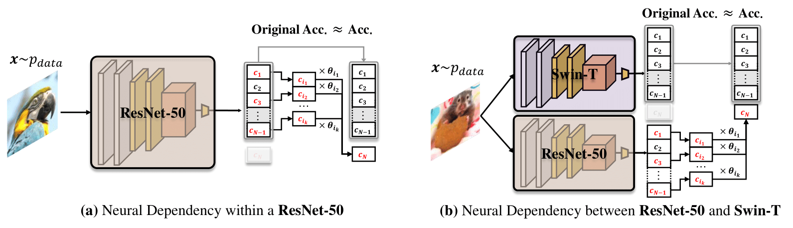
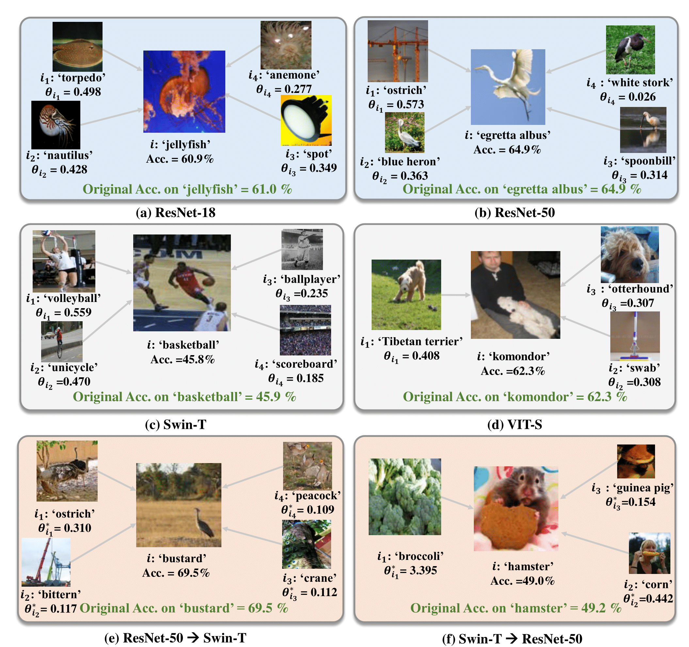

## Neural Dependencies Emerging from Learning Massive Categories
This is the project page of the paper "Neural Dependencies Emerging from Learning Massive Categories" (accepted to CVPR2023).

<p align="middle">
    
</p>

For more information, check out the paper on [[arXiv](https://arxiv.org/abs/2211.12339)].

## Requirements

- Python 3.8
- PyTorch 1.8.1 (>1.1.0)
- cuda 11.2

## Experiments
Coming soon.

## Results
<p align="middle">
    
</p>
   
## BibTeX
If you use this code for your research, please consider citing:
````BibTeX
@inproceedings{feng2023neural,
  title={Neural Dependencies Emerging from Learning Massive Categories},
  author={Feng, Ruili and Zheng, Kecheng and Zhu, Kai and Shen, Yujun and Zhao, Jian and Huang, Yukun and Zhao, Deli and Zhou, Jingren and Jordan, Michael and Zha, Zheng-Jun},
  booktitle={Proceedings of the IEEE/CVF Conference on Computer Vision and Pattern Recognition},
  pages={11711--11720},
  year={2023}
}
````
